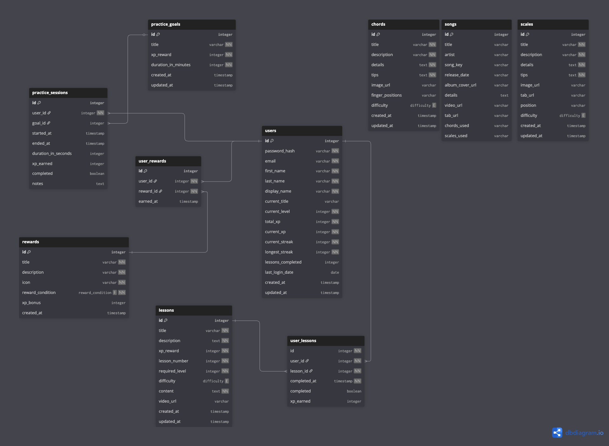

# Amplify — Gamified Guitar Learning Dashboard

## Description

Amplify is a full-stack gamified guitar learning dashboard built with React, Java, Spring Boot, and MySQL. It is designed for guitar players who want structured, motivating practice — combining a structured learning hub (lessons, chords, and scales with difficulty filtering and level-based locking), a timed practice session tracker, and a song library with embedded YouTube videos and tab links. As users work through content they earn XP, level up, maintain streaks, and unlock rewards, turning what is normally a solitary and untracked practice routine into a measurable and rewarding progression system.

---

## Technologies Used

### Frontend

[](https://skillicons.dev)

- **React 19** — component-based UI
- **React Router v7** — client-side routing and protected routes
- **Tailwind CSS v4** — utility-first responsive styling
- **Axios** — HTTP client with JWT interceptor
- **Motion** — animation library
- **Radix UI / Headless UI** — accessible UI primitives
- **Lucide React** — icon library
- **Vite** — development server and build tool

### Backend

[](https://skillicons.dev)

- **Java 21**
- **Spring Boot 4** — REST API framework
- **Spring Security** — authentication and route protection
- **Spring Data JPA / Hibernate** — ORM and database access
- **JSON Web Tokens (JJWT)** — stateless auth tokens
- **Bean Validation** — request validation
- **Spring Boot DevTools** — hot reloading during development

### Database

[](https://skillicons.dev)

- **MySQL** — relational database

---

## Installation & Local Setup

### Prerequisites
- Node.js (v18+) and npm
- Java 21 JDK
- Maven (or use the included `mvnw` wrapper)
- MySQL (running locally on port 3306)

### 1. Clone the repository

```bash
git clone https://github.com/joshliford/amplify-guitar.git
cd amplify-guitar
```

### 2. Set up the database

Create a MySQL database named `amplify_guitar`:

```sql
CREATE DATABASE amplify_guitar;
```

### 3. Configure backend environment

Open `java-spring-boot-back-end-app/src/main/resources/application.properties` and set your MySQL credentials:

```properties
spring.datasource.url=jdbc:mysql://localhost:3306/amplify_guitar
spring.datasource.username=YOUR_MYSQL_USERNAME
spring.datasource.password=YOUR_MYSQL_PASSWORD
```

You will also need to set your JWT secret key. Create a file `src/main/resources/application-local.properties` (already referenced by `spring.profiles.active=local`) and add:

```properties
jwt.secret=YOUR_BASE64_ENCODED_SECRET_KEY
```

### 4. Run the backend

```bash
cd java-spring-boot-back-end-app
./mvnw spring-boot:run
```

The API will start on `http://localhost:8080`. On first run, Hibernate will create the tables automatically (`ddl-auto=update`) and the `data.sql` file will seed initial data.

### 5. Run the frontend

In a separate terminal:

```bash
cd react-front-end-app
npm install
npm run dev
```

The app will be available at `http://localhost:5173`.

---

## Link to Wireframe

https://www.figma.com/design/JIxZXKdHptwK6SGeOcB6U4/Amplify-Wireframe-v1?node-id=0-1&t=jf92wXh3PQ3YgfC1-1

---

## ER Diagram



---

The database schema includes the following entities and relationships:

| Entity | Description |
|---|---|
| `users` | Registered users — stores profile, XP, level, streak, and title |
| `lessons` | Structured lessons with required level, XP reward, content, and optional video |
| `chords` | Chord reference content with difficulty |
| `scales` | Scale reference content with difficulty |
| `songs` | Song library entries with video URL, tab URL, chords/scales used |
| `practice_goals` | Preset practice goal templates with a target duration and XP reward |
| `practice_sessions` | Per-user timed practice sessions linked to a goal |
| `rewards` | Achievements defined by condition, icon, and optional XP bonus |
| `user_lessons` | Join table — tracks which lessons each user has completed and when |
| `user_rewards` | Join table — tracks which rewards each user has earned and when |

**Key relationships:**
- `User` → `PracticeSession` (one-to-many)
- `User` → `UserLesson` → `Lesson` (many-to-many via join table)
- `User` → `UserReward` → `Reward` (many-to-many via join table)
- `PracticeSession` → `PracticeGoal` (many-to-one)

---

## Unsolved Problems & Future Features

### Known Limitations
- **No admin interface** — seeding and managing lessons, chords, scales, and songs currently requires manual database changes or SQL scripts.
- **No password reset flow** — users who forget their password have no self-service recovery option.
- **Session storage for JWT** — the token is intentionally cleared when the browser tab closes (a security tradeoff over localStorage), but this means users must log in again each session.

### Planned Future Features

**Focused Practice Mode (The Shed):**
The most significant planned feature is a focused practice mode where users can select specific chords or scales from the Jam Room and queue them up in the Shed. Instead of a generic timer, the Shed would cycle through each queued item at a configurable interval — similar to flashcards with a built-in metronome. This would require:
- A practice queue state in the Shed component
- A new API endpoint associating practice sessions with specific chords or scales
- A cycling display component with configurable interval timing

**Additional Ideas**
- Social / leaderboard features — compare XP and streaks with other users
- Custom lesson creation — allow advanced users to author and share their own lessons
- Daily practice reminders / streak protection notifications
- AI chatbot integration - allow users to ask for song suggestions within the application based on chords/scales they are learning
